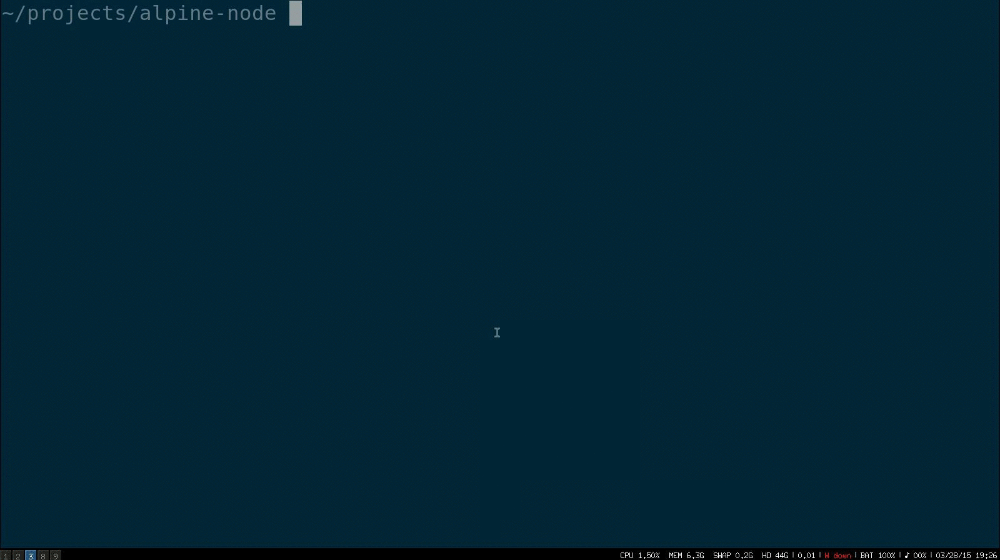

# Tiny Node.js Image (22 MB)

]

## Prerequisites

* [Docker](https://docs.docker.com/installation)
* [Compose](https://docs.docker.com/compose/install)

## Build and Run

    docker-compose build
    docker-compose run web

## Build and run without Compose

    docker build -t alpine-nodejs .
    docker run -v $(pwd):/tmp alpine-nodejs

## Get inside

    docker-compose run --entrypoint sh web
